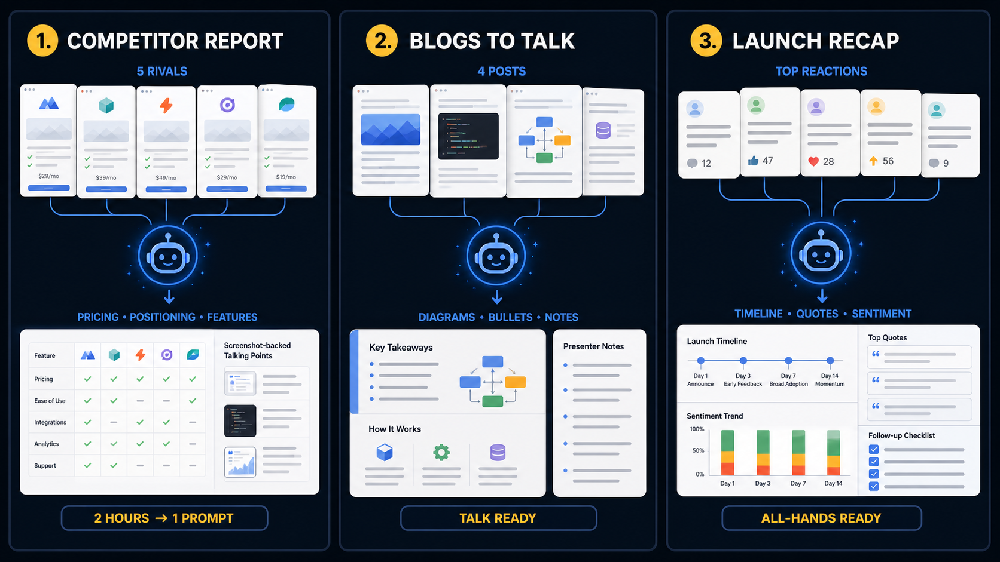

# AI-assisted Presentation System

A lightweight presentation renderer built for AI-generated decks and live screen sharing. Ask an AI agent to turn your source material into an XML presentation—including presenter notes for every slide that explain exactly what to say—then launch Presenter and get two separate windows: a clean **Presentation** canvas for the audience and a private **Presenter View** with your script.

Presenter works especially well with Microsoft Teams, Zoom, Google Meet, and other screen-sharing software. Choose **share this window** and select only the **Presentation** canvas. Your audience sees the slides while you read what to say for each slide from the AI-generated notes in **Presenter View**, navigate the deck, and deliver a polished presentation with little to no preparation.

**Let the AI agent make the entire presentation.** Give it git history, issue-tracker data, project notes, reports, articles, or any other source material. Tell the agent to use the provided [presentation skill](skills/presentation.md), which covers research synthesis, narrative structure, visual choices, presenter notes, and the exact XML format. The agent creates the slides, chooses layouts and images, and writes presenter notes containing the talking points, explanations, transitions, and wording you should read or say during each slide. You review the result, share the canvas, and present.


## Best with screen sharing

Presenter is designed around window sharing rather than sharing your entire desktop:

1. Ask an AI agent to generate the XML deck and a ready-to-read script in the presenter notes for every slide.
2. Launch it with `./build/presenter your-deck.xml`.
3. In Teams or another meeting app, choose **Share → Window** and select **Presentation**.
4. Keep **Presenter View** visible only to yourself and read or adapt its slide-by-slide script as you speak.

This keeps controls, notes, and other desktop activity private. Because the agent can prepare both the visual deck and the narration, Presenter is ideal for sprint demos, daily standups, project updates, briefings, and last-minute talks where there is little time to build slides or rehearse.

## Use Cases

**AI agents generating ready-to-deliver presentations** — the primary use case. An agent creates XML slide files from structured data such as git history, project status, or sprint summaries, writes what the presenter should say in the notes for every slide, and optionally captures screenshots of app states as rich visual content. The result is a polished presentation combining text, images, before/after comparisons, and a private slide-by-slide script you can read while presenting.

Typical workflow:

1. Give the agent your source material and explicitly ask it to follow [`skills/presentation.md`](skills/presentation.md).
2. The agent first collects and synthesizes all available information into an intermediate Markdown source file.
3. Using that source file, the agent designs the narrative and writes `scene.xml` with slides, images, and ready-to-say presenter notes.
4. Launch Presenter and share only the **Presentation** window in your meeting.
5. Read from **Presenter View** and deliver the talk.

### Hypothetical scenarios

**1. Competitor landscape report.** You need to brief your team on 5 rival products in 10 minutes. An agent fetches each competitor's homepage, extracts their pricing, positioning, and key features, scrapes their hero screenshots, and assembles a structured deck — title slide per competitor, side-by-side comparison table, and screenshot-backed talking points. What would take a human 2 hours is a single prompt.

**2. Conference talk from a blog series.** You wrote 4 blog posts about a technical deep-dive and got asked to give a talk on it tomorrow. An agent pulls the articles, rewrites verbose prose into bullet-pointed slides, pulls inline diagrams as standalone images, and produces a presenter-ready deck with speaker notes drawn from the original post intros. No copy-pasting, no slide design.

**3. Product launch recap from social media.** Your team shipped a feature and reactions are flying across Twitter, Reddit, and HN. An agent scrapes the top threads, pulls quote-worthy praise, downloads screenshots of the best reactions, and weaves them into a "launch recap" deck — timeline slide, highlight quotes, sentiment summary, and a closing slide with follow-up actions. Ready for the all-hands meeting in minutes.



## Features

- **XML slide format** with recursive composition — slides nest inside slides
- **6 layout types**: title, content, image, columns, section, blank
- **Dual-window output**: full audience screen + smaller presenter view with notes
- **Inline formatting**: `<b>bold</b>`, `<i>italic</i>`, `<code>code</code>` in text blocks
- **Image support**: PNG, JPG, JPEG, GIF, BMP with fit/fill scaling
- **Screenshot capture**: render slides to image files for embedding in other docs
- **Themeable**: XML style files for colors, fonts, and spacing; 8 built-in themes switchable at runtime
- **Keyboard controls**: arrow keys to navigate, Shift+Arrows to switch themes, F5 fullscreen, Escape to quit

## Prerequisites

- C++17 compiler
- CMake >= 3.10
- SDL2
- tinyxml2

### macOS (Homebrew)

```bash
brew install cmake sdl2 tinyxml2
```

### Ubuntu/Debian

```bash
sudo apt install cmake libsdl2-dev libtinyxml2-dev
```

## Build

```bash
cmake -B build
cmake --build build
```

## Run

```bash
./build/presenter demo/demo.xml
```

Override the theme at runtime:

```bash
./build/presenter demo/demo.xml --style demo/styles/light.xml
```

### Controls

| Key | Action |
|-----|--------|
| Right / Space / Enter | Next slide |
| Left / Backspace | Previous slide |
| Shift+Right | Next built-in theme |
| Shift+Left | Previous built-in theme |
| Home | First slide |
| End | Last slide |
| F5 | Toggle audience fullscreen |
| Escape | Quit |

## Screenshots

Capture a slide to an image file:

```bash
./build/presenter demo/demo.xml --screenshot=output/slide.png
```

This renders the current slide to a PNG and exits. Useful for:
- **Before/after demos** — capture app states and embed in image slides
- **Documentation** — generate slide images for READMEs or wikis
- **CI pipelines** — render presentations as part of automated reports

Example workflow for a sprint demo:

```bash
# 1. Generate the presentation XML
agent generate-sprint-demo --output=scenes/sprint23.xml

# 2. Capture key screenshots
./build/presenter scenes/sprint23.xml --screenshot=slides/sprint23_title.png

# 3. Present live
./build/presenter scenes/sprint23.xml
```

## Slide Format

Presentations are XML files with a `<presentation>` root containing `<slide>` children.

- **Full format reference**: [skills/presentation.md](https://corepunch.github.io/presenter/skills/presentation.md) — detailed guide with examples for all layouts
- **DTD schemas**: [schemas/presentation.dtd](https://corepunch.github.io/presenter/schemas/presentation.dtd) and [schemas/style.dtd](https://corepunch.github.io/presenter/schemas/style.dtd) — formal XML validation

### DOCTYPE Declaration

Include the DTD in your presentation files for validation:

```xml
<?xml version="1.0" encoding="UTF-8"?>
<!DOCTYPE presentation SYSTEM "https://corepunch.github.io/presenter/schemas/presentation.dtd">
<presentation>
  ...
</presentation>
```

### Quick Example

```xml
<?xml version="1.0" encoding="UTF-8"?>
<!DOCTYPE presentation SYSTEM "https://corepunch.github.io/presenter/schemas/presentation.dtd">
<presentation>
  <slide layout="title" title="My Talk">
    <notes>Welcome everyone. Today I will explain the three ideas that matter most.</notes>
    <subtitle>Subtitle here</subtitle>
  </slide>

  <slide layout="content" title="Key Points">
    <notes>These points form the core of the talk. I will start with the first and show how each one leads to the next.</notes>
    <text><b>Bold</b> point one</text>
    <text>Point two</text>
    <text>Point three</text>
  </slide>
</presentation>
```

### For AI Agents

Use the provided [presentation skill](skills/presentation.md) when generating a deck. It explains how to research the subject, build a coherent presentation structure, write useful presenter notes, choose layouts and visuals, and produce valid Presenter XML. The hosted [Slide Format Reference](https://corepunch.github.io/presenter/skills/presentation.md) contains the same guidance. Always include the DOCTYPE declaration pointing to `https://corepunch.github.io/presenter/schemas/presentation.dtd`.

Recommended workflow:

1. Gather all available source material into an intermediate `.md` file, preserving facts, evidence, links, quotes, and unresolved questions.
2. Define the audience, objective, central message, narrative arc, and slide outline from that source file.
3. Convert the outline into XML using the skill, [`schemas/presentation.dtd`](schemas/presentation.dtd), and the examples in this repository.
4. Capture or create useful visuals and reference them in `<image>` elements with relative paths.
5. Include `<notes>` on every slide with a natural, ready-to-say script: context, evidence, what to emphasize, and the transition to the next slide.
6. Validate and review the complete deck, then present it live or render it to images.

## Layouts

| Layout | Description |
|--------|-------------|
| `title` | Centered title + optional subtitle (opening/closing slides) |
| `content` | Title + vertical stack of text blocks (default) |
| `image` | Title + full-width image + caption |
| `columns` | Title + horizontal slots via child slides with `slot` attribute |
| `section` | Centered title only (divider) |
| `blank` | No header, children fill full area |

## Theming

8 built-in themes ship with the presenter, switchable at runtime with `Shift+Left` / `Shift+Right`:

| # | Theme | Style |
|---|-------|-------|
| 1 | Dracula | Dark (default) |
| 2 | Monokai | Dark |
| 3 | Solarized Dark | Dark |
| 4 | GitHub Light | Light |
| 5 | Solarized Light | Light |
| 6 | Nord | Neutral |
| 7 | Sunset | Warm |
| 8 | Arc | Cool |

Custom styles use the format defined in [schemas/style.dtd](https://corepunch.github.io/presenter/schemas/style.dtd):

```xml
<style>
  <colors bg="#1E1E28" text="#C8C8D2" accent="#FFCC00"/>
  <fonts title="48" content="28"/>
  <layout margin="40" gap="24"/>
</style>
```

Reference a style from the presentation:

```xml
<presentation style="./styles/dark.xml">
```

## Project Structure

```
presenter/
├── src/            # Source files
├── include/        # Headers
├── demo/           # Example presentation and styles
├── docs/           # DTD schemas and format spec
├── test/           # Test executables
├── assets/         # Bundled fonts (Inter, JetBrains Mono)
├── examples/       # Markdown-format demo
└── CMakeLists.txt
```

## Testing

```bash
cmake --build build
./build/test_textbounds
./build/test_layout
./build/test_xml_parser
./build/test_image
```

## License

See repository for license details.
