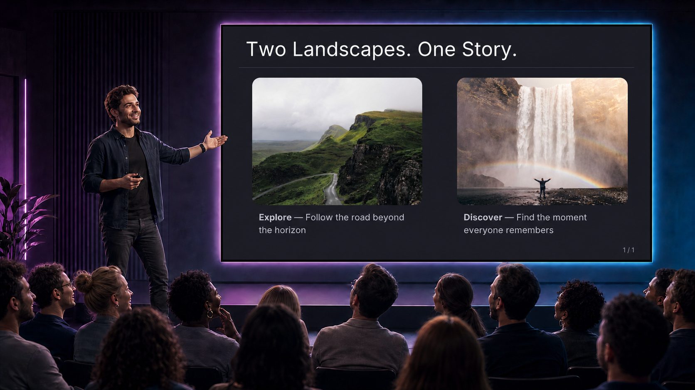
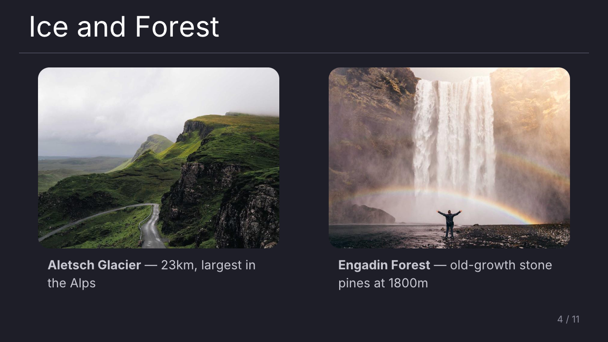
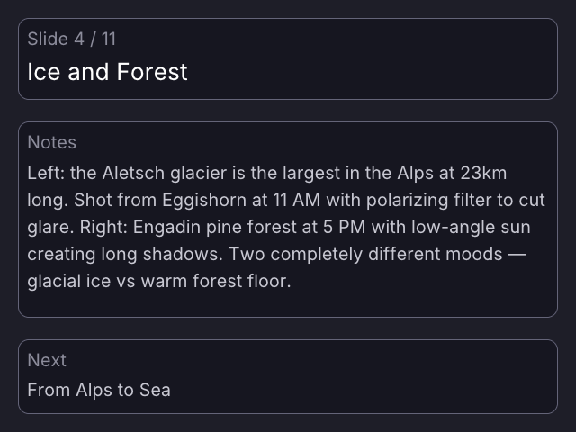
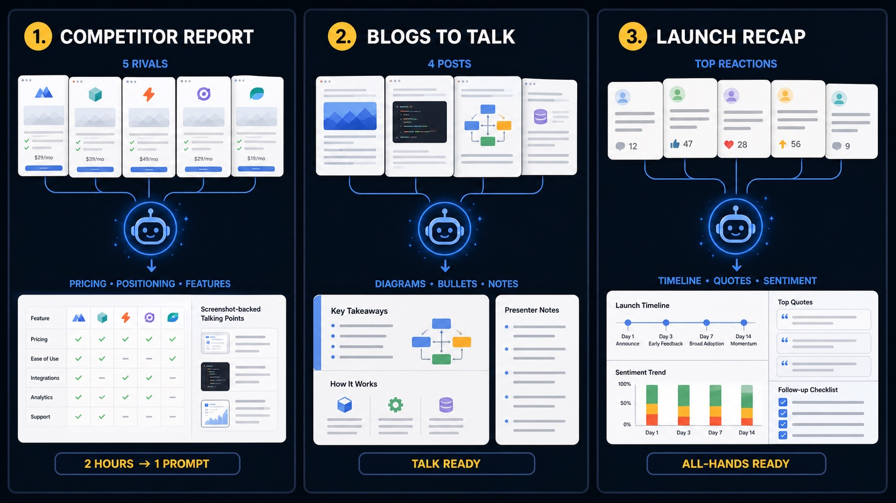

# Presenter - AI-powered presentations and transcripts

A lightweight presentation renderer built for AI-generated decks and live screen sharing. Ask an AI agent to turn your source material into an XML presentation—including presenter notes for every slide that explain exactly what to say—then launch Presenter and get two separate windows: a clean **Presentation** canvas for the audience and a private **Presenter View** with your script.



Presenter works especially well with Microsoft Teams, Zoom, Google Meet, and other screen-sharing software. Choose **share this window** and select only the **Presentation** canvas. Your audience sees the slides while you read what to say for each slide from the AI-generated notes in **Presenter View**, navigate the deck, and deliver a polished presentation with little to no preparation.

**Let the AI agent make the entire presentation.** Give it git history, issue-tracker data, project notes, reports, articles, or any other source material. Tell the agent to use the provided [presentation skill](skills/presentation.md), which covers research synthesis, narrative structure, visual choices, presenter notes, and the exact XML format. The agent creates the slides, chooses layouts and images, and writes presenter notes containing the talking points, explanations, transitions, and wording you should read or say during each slide. You review the result, share the canvas, and present.


### The audience view and your private script

<table>
  <tr>
    <td width="67%">
      
    </td>
    <td width="33%">
      
    </td>
  </tr>
  <tr>
    <td><b>Audience window</b> — clean, focused slides ready to share.</td>
    <td><b>Presenter View</b> — notes and the next slide stay private.</td>
  </tr>
</table>

## Best with screen sharing

Presenter is designed around window sharing rather than sharing your entire desktop:

1. Ask an AI agent to generate the XML deck and a ready-to-read script in the presenter notes for every slide.
2. Launch it with `./build/presenter your-deck.slides`.
3. In Teams or another meeting app, choose **Share → Window** and select **Presentation**.
4. Keep **Presenter View** visible only to yourself and read or adapt its slide-by-slide script as you speak.

This keeps controls, notes, and other desktop activity private. Because the agent can prepare both the visual deck and the narration, Presenter is ideal for sprint demos, daily standups, project updates, briefings, and last-minute talks where there is little time to build slides or rehearse.

## Use Cases

**AI agents generating ready-to-deliver presentations** — the primary use case. An agent creates XML slide files from structured data such as git history, project status, or sprint summaries, writes what the presenter should say in the notes for every slide, and optionally captures screenshots of app states as rich visual content. The result is a polished presentation combining text, images, before/after comparisons, and a private slide-by-slide script you can read while presenting.

Typical workflow:

1. Give the agent your source material and explicitly ask it to follow [`skills/presentation.md`](skills/presentation.md).
2. The agent first collects and synthesizes all available information into an intermediate Markdown source file.
3. Using that source file, the agent designs the narrative and writes a `scene.slides` package containing `presentation.xml`, images, and ready-to-say presenter notes.
4. Launch Presenter and share only the **Presentation** window in your meeting.
5. Read from **Presenter View** and deliver the talk.

### Hypothetical scenarios

**1. Competitor landscape report.** You need to brief your team on 5 rival products in 10 minutes. An agent fetches each competitor's homepage, extracts their pricing, positioning, and key features, scrapes their hero screenshots, and assembles a structured deck — title slide per competitor, side-by-side comparison table, and screenshot-backed talking points. What would take a human 2 hours is a single prompt.

**2. Conference talk from a blog series.** You wrote 4 blog posts about a technical deep-dive and got asked to give a talk on it tomorrow. An agent pulls the articles, rewrites verbose prose into bullet-pointed slides, pulls inline diagrams as standalone images, and produces a presenter-ready deck with speaker notes drawn from the original post intros. No copy-pasting, no slide design.

**3. Product launch recap from social media.** Your team shipped a feature and reactions are flying across Twitter, Reddit, and HN. An agent scrapes the top threads, pulls quote-worthy praise, downloads screenshots of the best reactions, and weaves them into a "launch recap" deck — timeline slide, highlight quotes, sentiment summary, and a closing slide with follow-up actions. Ready for the all-hands meeting in minutes.



## Check a presentation before presenting

```sh
presenter --check "My Talk.slides"
presenter --check --json --strict "My Talk.slides"
presenter --check "My Talk.slides" --slide 3
```

Checks run headlessly using the renderer's 1280×720 measure/arrange layout.
Reports identify the slide, element path, source image, measured dimensions,
severity, and a suggested action. JSON includes stable issue codes, bounds,
measurements, and `schemaVersion: 1` for agent feedback loops.

- Errors: missing/unreadable images and unavailable icons.
- Warnings: overflowing text/code, clipped or zero-sized elements, empty slides,
  text below 18px, text contrast below 3:1, images enlarged to at least 200%,
  and fill crops removing more than half the source area.
- Information: images reduced to 10% or less. This is often intentional;
  enlarge the display area only if important details become unreadable.

Scale percentages compare displayed dimensions with sampled source pixels
(100% means 1:1), not image area. Thresholds are advisory, not design rules.
Normal checks exit 0 even with findings; `--strict` exits 2 for warnings/errors.
Invalid input or execution failures exit 1. `--json` keeps stdout JSON-only;
diagnostics go to stderr. Check mode cannot be combined with screenshot mode.

Agents should generate → check → revise → render and visually inspect.
Checks cannot judge image meaning, detect text inside images, or guarantee a
good composition. Contrast checks cover text elements against inherited solid
backgrounds, not overlapping images, gradients, inline colors, or chart labels.
Presenter notes are not checked. Always review screenshots too.

## Features

- **XML slide format** with recursive composition — containers nest inside containers
- **Explicit layouts**: stacks, grids, and padded borders with measure/arrange
- **Headless sanity checks**: actual layout measurements, image scaling/cropping, actionable issues and JSON for agents
- **Dual-window output**: full audience screen + smaller presenter view with notes
- **Inline formatting**: `<b>bold</b>`, `<i>italic</i>`, `<code>code</code>` in text blocks
- **Image support**: PNG, JPG, JPEG, GIF, BMP with fit/fill scaling
- **Native charts**: themed bar, line, pie, and donut charts directly from XML data
- **Named icons**: bundled Font Awesome Free icons for clear visual callouts
- **Screenshot capture**: render slides to image files for embedding in other docs
- **Themeable**: XML style files for colors, fonts, and spacing; 8 built-in themes switchable at runtime
- **Keyboard controls**: arrow keys to navigate, Shift+Arrows to switch themes, F5 fullscreen, Escape to quit

## Prerequisites

- C++17 compiler
- pkg-config
- SDL2

tinyxml2 is vendored in `third_party/` and built from source.

### macOS (Homebrew)

```bash
brew install sdl2
```

### Ubuntu/Debian

```bash
sudo apt install pkg-config libsdl2-dev
```

## Build

```bash
make
```

## Run

```bash
./build/presenter "demo/Nature Portfolio.slides"
```

Override the theme at runtime:

```bash
./build/presenter "demo/Nature Portfolio.slides" \
  --style "demo/Nature Portfolio.slides/styles/light.style"
```

### Controls

| Key | Action |
|-----|--------|
| Right / Space / Enter | Next slide |
| Left / Backspace | Previous slide |
| Shift+Right | Next built-in theme |
| Shift+Left | Previous built-in theme |
| Home | First slide |
| End | Last slide |
| F5 | Toggle audience fullscreen |
| S | Save the audience view as PNG |
| Shift+S | Save the presenter view as PNG |
| Escape | Quit |

## Screenshots

Capture a slide to an image file:

```bash
./build/presenter "demo/Nature Portfolio.slides" --slide 7 --screenshot output/slide.png
```

Capture the matching private presenter view, or both views in one run:

```bash
./build/presenter "demo/Nature Portfolio.slides" --slide 7 \
  --screenshot output/slide.png \
  --presenter-screenshot output/notes.png
```

These commands render headlessly to PNG and exit. Parent directories are created automatically. During a live presentation, press `S` to save the audience window as `presenter-slide-NN.png`, or `Shift+S` to save `presenter-notes-NN.png`.

Useful for:
- **Before/after demos** — capture app states and embed in image slides
- **Documentation** — generate slide images for READMEs or wikis
- **CI pipelines** — render presentations as part of automated reports

Example workflow for a sprint demo:

```bash
# 1. Generate the presentation XML
agent generate-sprint-demo --output=scenes/sprint23.slides

# 2. Capture key screenshots
./build/presenter scenes/sprint23.slides --slide 1 --screenshot slides/sprint23_title.png

# 3. Present live
./build/presenter scenes/sprint23.slides
```

## Slide Format

Presentations are directory packages. The `.slides` extension keeps the XML,
images, and custom styles together:

```text
My Talk.slides/
├── presentation.xml
├── images/
│   └── architecture.png
└── styles/
    └── custom.style
```

`presentation.xml` has a `<presentation>` root containing `<slide>` children.
Relative paths resolve from the package root. The command-line renderer also
continues to accept legacy single-file `.slides` XML decks.

- **Full format reference**: [skills/presentation.md](https://corepunch.github.io/presenter/skills/presentation.md) — detailed guide with examples for all layouts
- **DTD schemas**: [schemas/presentation.dtd](https://corepunch.github.io/presenter/schemas/presentation.dtd) and [schemas/style.dtd](https://corepunch.github.io/presenter/schemas/style.dtd) — formal XML validation

### DOCTYPE Declaration

Include the DTD in your presentation files for validation:

```xml
<?xml version="1.0" encoding="UTF-8"?>
<!DOCTYPE presentation SYSTEM "https://corepunch.github.io/presenter/schemas/presentation.dtd">
<presentation name="My Talk">
  ...
</presentation>
```

### Quick Example

```xml
<?xml version="1.0" encoding="UTF-8"?>
<!DOCTYPE presentation SYSTEM "https://corepunch.github.io/presenter/schemas/presentation.dtd">
<presentation name="My Talk">
  <slide title="My Talk">
    <notes>Welcome. Today we will agree on the next milestone.</notes>
    <stack margin="60" gap="24" verticalAlignment="center">
      <text role="title">My Talk</text>
      <text role="subtitle">The next milestone</text>
    </stack>
  </slide>
</presentation>
```

### For AI Agents

Use the provided [presentation skill](skills/presentation.md) when generating a deck. It explains how to research the subject, build a coherent presentation structure, write useful presenter notes, choose layouts and visuals, and produce valid Presenter XML. The hosted [Slide Format Reference](https://corepunch.github.io/presenter/skills/presentation.md) contains the same guidance. Always include the DOCTYPE declaration pointing to `https://corepunch.github.io/presenter/schemas/presentation.dtd`.

Recommended workflow:

1. Gather all available source material into an intermediate `.md` file, preserving facts, evidence, links, quotes, and unresolved questions.
2. Define the audience, objective, central message, narrative arc, and slide outline from that source file.
3. Convert the outline into XML using the skill, [`schemas/presentation.dtd`](schemas/presentation.dtd), and the examples in this repository.
4. Capture or create useful visuals and reference them in `<image>` elements with relative paths.
5. Include `<notes>` on every slide with a natural, ready-to-say script: context, evidence, what to emphasize, and the transition to the next slide.
6. Validate and review the complete deck, then present it live or render it to images.

## Layouts

Only explicit layouts are supported: `stack`, `grid`, and `border`, containing
ordered text, image, code, chart, and icon elements. Grids support pixel, auto,
and weighted-star tracks, with row/column spans. Elements support margins,
padding, constraints, and alignment. Text never silently shrinks to fit.

This is a breaking format change: preset attributes and nested slides are
rejected. See [the format guide](skills/presentation.md) and migrated demos.

## Theming

12 built-in themes ship with the presenter, switchable at runtime with `Shift+Left` / `Shift+Right`.
Studio is the default for new decks. See [theme examples and overrides](docs/themes.md).

| # | Theme | Style |
|---|-------|-------|
| 1 | Studio | Midnight and gold (default) |
| 2 | Porcelain | Ivory and plum |
| 3 | Tidal | Ocean and mint |
| 4 | Ember | Aubergine and peach |
| 5 | Dracula | Dark |
| 6 | Monokai | Dark |
| 7 | Solarized Dark | Dark |
| 8 | GitHub Light | Light |
| 9 | Solarized Light | Light |
| 10 | Nord | Neutral |
| 11 | Sunset | Warm |
| 12 | Arc | Cool |

Custom styles use the format defined in [schemas/style.dtd](https://corepunch.github.io/presenter/schemas/style.dtd):

```xml
<style>
  <colors bg="#1E1E28" text="#C8C8D2" accent="#FFCC00"/>
  <charts series1="#FFCC00" series2="#56B6C2" series3="#98C379"
          grid="#646478" label="#C8C8D2"/>
  <fonts title="48" content="28"/>
  <layout margin="40" gap="24" cornerRadius="24" presenterCornerRadius="12"/>
</style>
```

Reference a style from the presentation:

```xml
<presentation style="./styles/dark.style">
```

## Project Structure

```
presenter/
├── src/            # Source files
│   ├── ui.cpp          # Declarative UI layout engine
│   ├── renderer.cpp    # Slide + presenter view rendering
│   ├── layout.cpp      # Ordered XML → visual tree factory
│   ├── image.cpp       # Image loading and scaling
│   ├── charts.cpp      # Bar, line, pie, donut, and icon rendering
│   ├── font.cpp        # TTF font loading via stb_truetype
│   ├── highlight.cpp   # Syntax highlighting
│   ├── xml_parser.cpp  # XML → Presentation tree
│   ├── style.cpp       # Theme loading + 8 built-in themes
│   └── main.cpp        # Entry point, SDL windows, event loop
├── include/        # Headers
│   ├── ui.hpp          # ui::Element, Stack, Grid, Border, Text
│   ├── common.h        # Slide, Presentation, ordered LayoutNode tree
│   ├── style.h         # PresentationStyle, Color
│   ├── font.h          # FontSet, FontVariants
│   ├── renderer.h      # Renderer class
│   ├── layout.h        # Visual tree factory
│   └── image.h         # ImageBuf, ImageRect
├── demo/           # Example presentation and styles
├── docs/           # DTD schemas and format spec
├── test/           # Test executables
├── assets/         # Bundled fonts (Inter, JetBrains Mono, Font Awesome Free)
├── examples/       # Markdown-format demo
└── Makefile
```

Font Awesome Free is bundled under the SIL Open Font License 1.1, with its
MIT-licensed name map. Browse the official
[Free + Solid icon gallery](https://fontawesome.com/search?ic=free&s=solid) and
use the displayed name in `icon="..."`. The upstream license is included at
[`assets/LICENSE-Font-Awesome.txt`](assets/LICENSE-Font-Awesome.txt).

## Architecture

### Shared measure/arrange pipeline

Slides and the presenter view use `ui::Element`: `measure()` delegates to
`measureOverride()`, then `arrange()` delegates to `arrangeOverride()`. Grid
resolves column widths before measuring wrapped heights. Rendering clips to
allocated bounds and reports overflow. Slide titles are metadata; all visible
content comes from the explicit element tree.

### Presenter view

The presenter view uses the same measure/arrange engine as slides: a plain
background, an undecorated padding container, and a vertical stack with zero
gap. The current title uses the body font size, notes use the small font size,
and the next title uses small, pale-yellow text prefixed with `Next:` and
12px of space above it. Empty title/notes fields are omitted. There
are no counters, section labels, cards, borders, or flexible spacers. The theme's
`presenterMargin` controls the outer padding; regular font line spacing remains.
make test
# Run only measurement and arrangement tests:
make build/test_layout && ./build/test_layout
```

The layout suite runs headlessly, using synthetic leaves with known intrinsic
sizes plus bundled-font text cases. It covers override lifecycles, constraints,
all alignment combinations, margins, padding, stacks, grow weights, grid tracks
and spans, nested containers, remeasurement, resizing, overflow, and rounding.
Sweeps verify pixel conservation and span geometry across declaration orders.
Checks remain active with `NDEBUG`, and failures print the case name, source
line, expected value, and actual value.

## License

See repository for license details.
